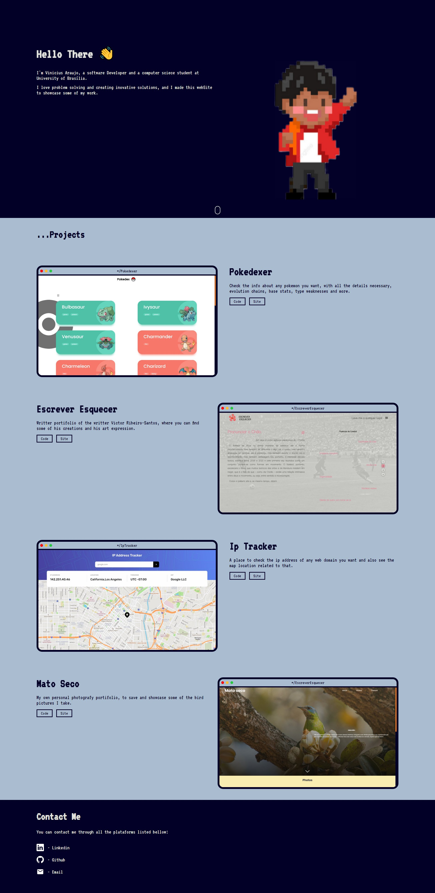

# devPortifolio
My software developer portfolio
## Overview
This project is a simple single page site I made to have a way to show my work to other people and give them a way to contact me.

To make it I used React and typescript.

## Screenshot

## Link

-Live site Url: [https://viniciusaraujo.netlify.app](www.viniciusaraujo.netlify.app)

## Build Process

I used vite to start this project with the React and typescript basic configuration, for the styling I used the Styled Components library. Then I separated the site 
in three main sections (about, projects and contact), picked a color palete using the coolors tool and a kind of pixelated font in google fonts. 

Afterwards I proceded making a pretty simple about section with just the text and a image to fill the rest. For the projects section I wanted to make somthing 
different, and I was pretty curious and interested about using the gsap library, so I had this idea to make some macOs window kind of card to put an image 
of the project site and to add some 3d css animation triggered through scroll using gsap. Finally I made the contact part by just adding some links alongside 
their respective React Icons svg icon.

Another thing I added was a header that hides when you scroll down and apears only when you scroll upwards. To implement this feature I made a custom react hook to 
capture the window current scrool position and it's previous value. So I can figure out the user scroll direction and manage the header state.
